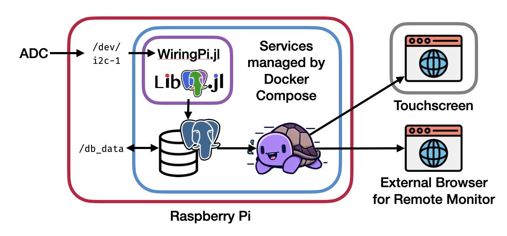

# Pressure Gauge Monitoring System

A Julia application for monitoring multiple vacuum pressure gauges, storing time-series data in PostgreSQL, and visualizing it via SlowDash.

If you have basic Docker knowledge, follow this [quick start page](docs/quickstart.md) to interact with and understand the system's internal structure.
